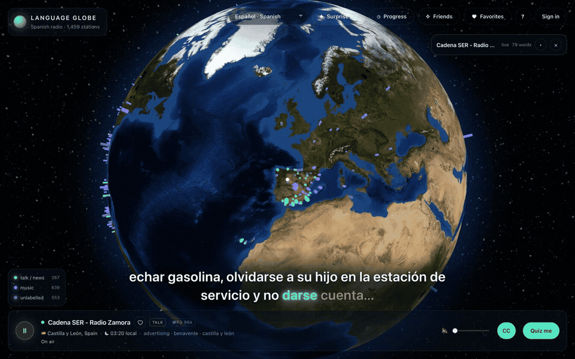
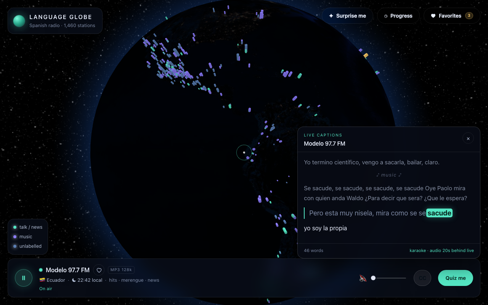
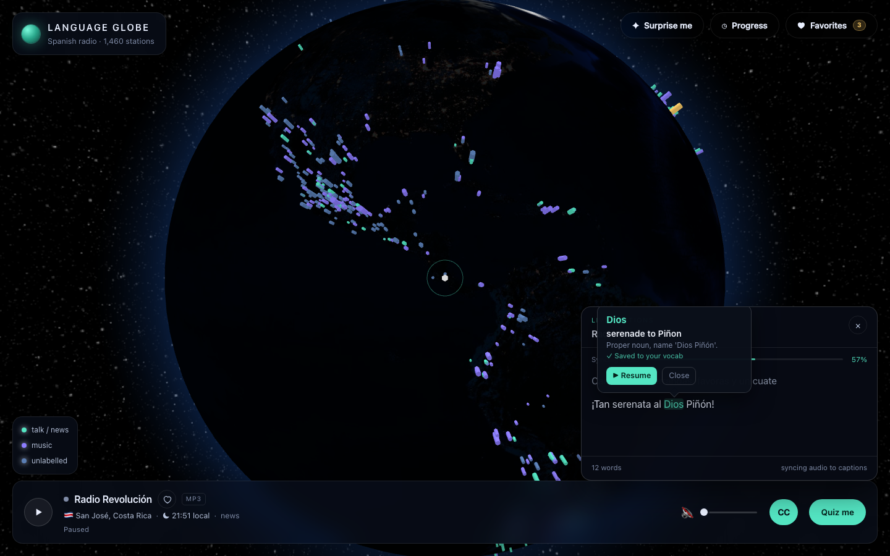
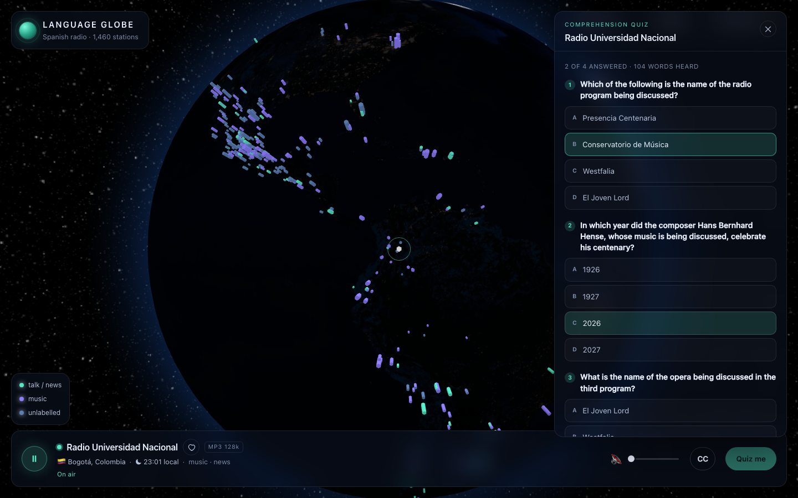
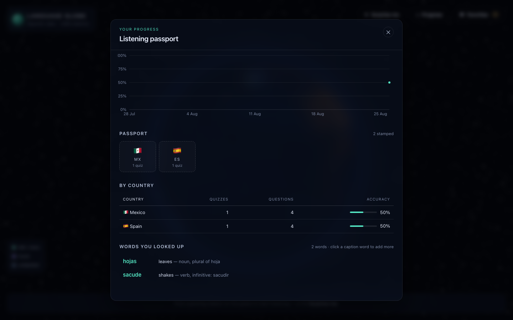

# Language Globe

**Spin a 3D Earth, tune into live radio anywhere in the world, and learn a language from what's actually on the air right now.**

Live streams get synced karaoke captions with word-by-word highlighting, any word you don't know is one click away from a translation that's saved to your vocab list, and a comprehension quiz is generated from the last minute of whatever you were listening to. The target language is configurable and defaults to Spanish.



## What it does

### 1,400+ live stations on a 3D globe

Every pin is a real radio station streaming right now, colored by content type (talk/news, music, unlabelled). Click a pin — or hit **Surprise me** — and you're listening within seconds, with the station's local time and genre in the player. Favorites are saved, dead streams are dimmed.

### Synced karaoke captions

Press **CC** and the app buffers the stream for a few seconds so it can transcribe *ahead* of what you hear. Words light up one-by-one exactly as they're spoken — timing comes from whisper.cpp's DTW-aligned token timestamps, not interpolation. Music passages are detected and collapsed to a ♪ marker.



### Click a word you don't know

Clicking any caption word pauses the radio and pops up the English translation with a short grammar note (part of speech, dictionary form). The word is saved to your account automatically — looking it up again just bumps a counter.



### Comprehension quizzes from live radio

**Quiz me** captures the next 60 seconds of audio, transcribes it, and generates four multiple-choice questions about what was just said — graded server-side against the transcript, which you can review afterwards. These questions were generated from a live classical-music program in Bogotá:



### A listening passport

Accuracy over time, daily streaks, countries you've quizzed in, total words heard — and every word you've looked up, newest first, with the sentence you heard it in.



## Local models first

Captions and quizzes prefer models running on your machine and fall back to OpenAI only when a key is configured:

| Task | Local (preferred) | Fallback |
| --- | --- | --- |
| Transcription + word timing | whisper.cpp (`whisper-server`, DTW alignment) | OpenAI Whisper |
| Quiz generation | Ollama (`qwen2.5:7b-instruct`) | OpenAI chat model |
| Word translation | Ollama (`qwen2.5:7b-instruct`) | OpenAI chat model |
| Ambient scene art | SDXL-Turbo (`scene-server/`, local only) | — |

With whisper.cpp and Ollama running, the whole experience — captions, karaoke, lookups, quizzes — works with **no API key and no per-use cost**.

### Ambient scenes

With captions on, the panel draws a stylized illustration of whatever the station is talking about, redrawn from the live transcript every ~45 s (Ollama writes the visual prompt, SDXL-Turbo paints it — a few seconds per image on Apple Silicon). It is entirely optional and turns on when the sidecar is running:

```bash
scene-server/run.sh   # first run creates a venv and downloads ~7 GB of weights
```

## Setup

```bash
npm install
cp server/.env.example server/.env
npm run dev
```

The Vite frontend runs on `http://127.0.0.1:5173` and proxies API requests to the Fastify server on `http://127.0.0.1:8787`.

The globe, station search, player, favorites, and stats work with no configuration. Captions, lookups, and quizzes need at least one model provider — local models via `WHISPER_SERVER_BIN`/`WHISPER_MODEL_PATH` and `OLLAMA_URL`, or:

```bash
OPENAI_API_KEY=your_key_here
```

Useful environment settings:

```bash
TARGET_LANGUAGE=spanish
OPENAI_QUIZ_MODEL=gpt-4o-mini
OPENAI_TRANSCRIBE_MODEL=whisper-1
CAPTURE_SECONDS=60
DB_PATH=data/language-globe.sqlite
PORT=8787
HOST=127.0.0.1
```

`ffmpeg` is recommended for capture from HLS, AAC, Ogg, or unlabeled radio streams. Plain MP3/M4A/WAV/WebM streams can be captured directly.

## Docker

Every merge to `main` publishes a ready-to-run image to GitHub Container Registry (`.github/workflows/docker.yml`). The container serves the web UI and the API on one port and bundles ffmpeg:

```bash
docker run -p 8787:8787 ghcr.io/luke-mcevoy/language-globe:latest
# open http://localhost:8787
```

The globe, live radio, favorites, and stats work with no configuration. Captions and quizzes need a model provider:

```bash
docker run -p 8787:8787 \
  -e OPENAI_API_KEY=your_key_here \           # transcription + quiz fallback
  -e OLLAMA_URL=http://host.docker.internal:11434 \  # optional: local quiz model
  -v language-globe-data:/data \              # persist quiz history across restarts
  ghcr.io/luke-mcevoy/language-globe:latest
```

Local whisper.cpp transcription is not bundled (the model weighs ~1.5 GB); inside Docker, transcription uses OpenAI when a key is set. To build the image yourself: `docker build -t language-globe .`

## Mobile

The Expo app lives in `mobile/` and uses the same Fastify API. For phone testing, expose the server on your LAN:

```bash
HOST=0.0.0.0 npm run dev:server
cd mobile
npx expo start
```

Scan the QR code with Expo Go. The app resolves the API URL from `EXPO_PUBLIC_API_URL` first, then from Expo's dev host with port `8787`, then falls back to `http://localhost:8787`.

Use an explicit override when the automatic LAN address is not right:

```bash
EXPO_PUBLIC_API_URL=http://192.168.1.20:8787 npx expo start
```

## Scripts

```bash
npm run typecheck
npm run build
npm test
npm run dev
npm start
```

## Architecture

```text
frontend (Vite + React + TS)          server (Node + Fastify + TS)
  3D globe (react-globe.gl)    <-->     GET  /api/stations
  audio player (hls.js)        <-->     GET  /api/health
  captions panel (karaoke)     <-->     POST /api/captions/session   (+ poll, delayed audio relay)
  word lookup popover          <-->     POST /api/vocab/lookup, GET /api/vocab
  quiz panel                   <-->     POST /api/quiz/start, POST /api/quiz/submit
  stats / passport view        <-->     GET  /api/stats
```

Stations come from Radio Browser and are cached for six hours in memory and SQLite. The server stores quizzes, transcripts, answer keys, graded results, and vocab lookups locally, so grading is server-side and progress can be aggregated over time.

## Roadmap

v2: shareable challenge links.  
v3: friends, leaderboards, and more target languages.
